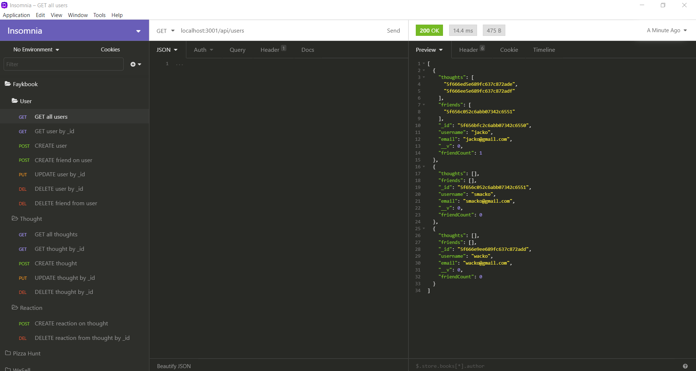

# Faykbook

## Description

A social network API built with Express.js, MongoDB and Mongoose

## Table of Contents
  * [Installation](#installation)
  * [Usage](#usage)
  * [License](#license)
  * [Contributing](#contributing)
  * [Testing](#testing)
  * [Questions](#questions)
  
## Installation
Clone project to a directory on your local machine and cd into the faykbook directory.  Run <$ npm install> to install Express.js and Mongoose dependencies.

## Usage
Run <$ npm start> to launch Express server and MongoDB database.  Use an http client such as Insomnia Core or Postman to make requests to the available endpoints as demonstrated in the following two videos.
* [Episode 1](https://drive.google.com/file/d/1m-iNYASuUdaR245iwuuGlDKe871U30YZ/view)
* [Episode 2](https://drive.google.com/file/d/1SO-Pi-mELc7Xv87L66eE3cUpC6vGTRYc/view)

## License 
This project is covered under the MIT license 

## Contributing
To see the guidelines adopted for contributing to this project, please view the [Contributor Covenant](https://www.contributor-covenant.org/version/2/0/code_of_conduct/code_of_conduct.txt)

## Testing
Tests coming soon

## Questions
Visit me at GitHub  
[christopherConcannon](https://github.com/christopherConcannon)
  
If you have any questions or would like to contact me, please email me at  
[cmcon@yahoo.com](mailto:cmcon@yahoo.com)
